# Data Flow Diagrams

This document describes the data flows and interactions between different components of the HTX Interface system using Mermaid diagrams.

## WebSocket Ticker Flow

This diagram shows the real-time data flow for cryptocurrency ticker updates via WebSocket connection.

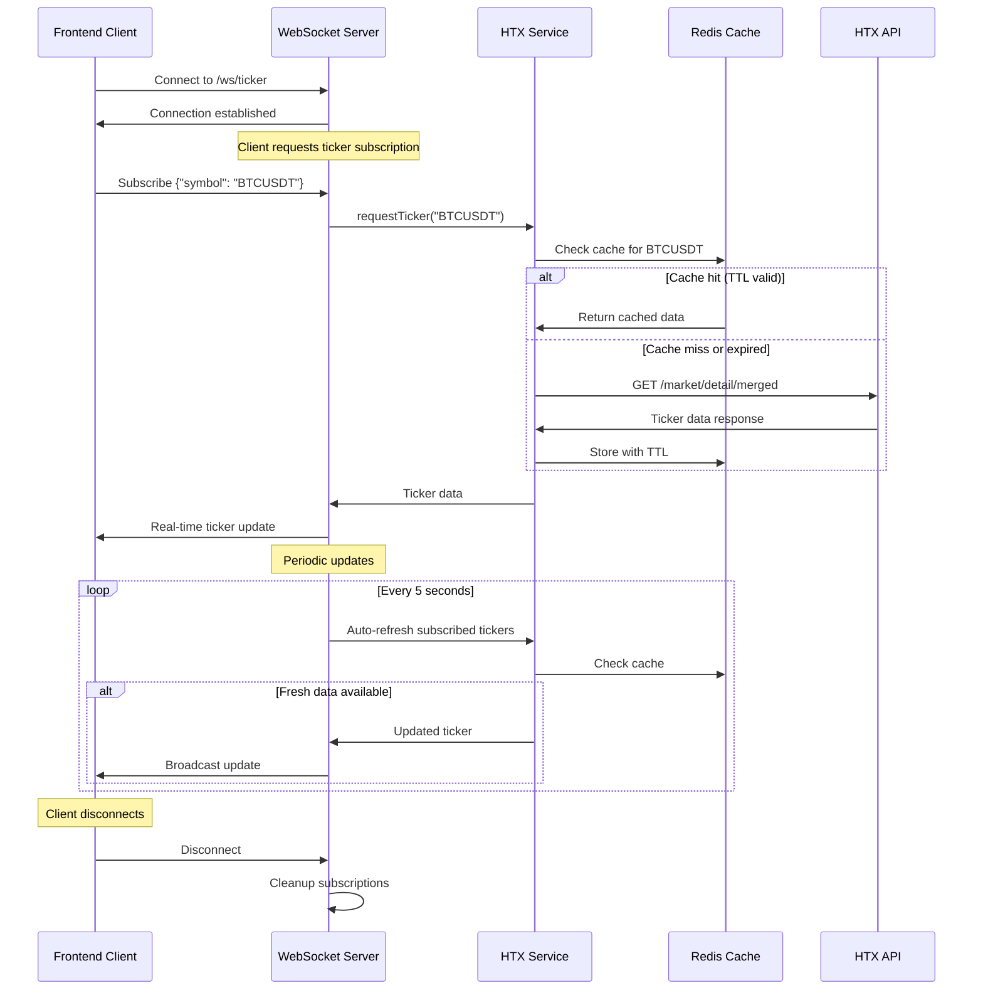

## HTTP API Ticker Flow

This diagram shows the traditional HTTP request-response flow for ticker data.

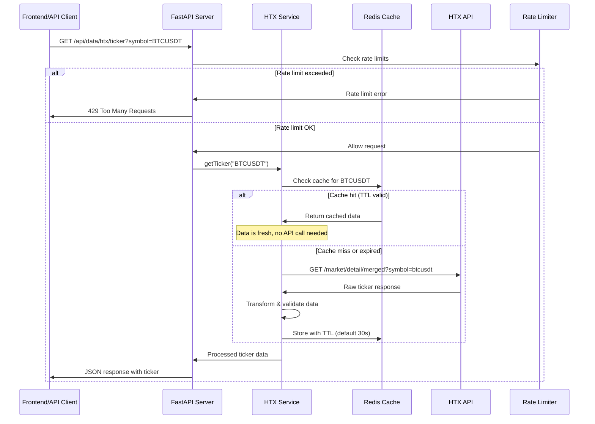

## Health Check Flow

This diagram shows the health monitoring and system status checking flow.

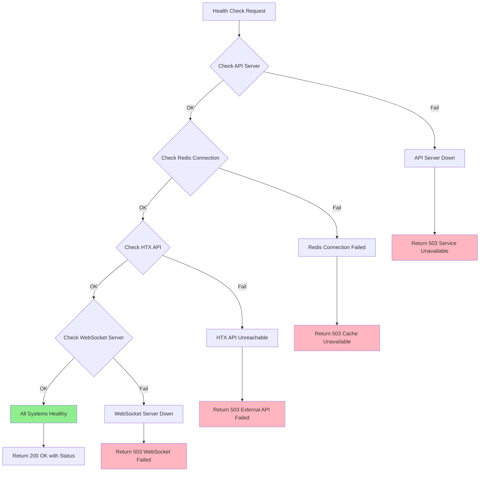

## Error Handling and Retry Logic

This diagram shows how the system handles errors and implements retry mechanisms.

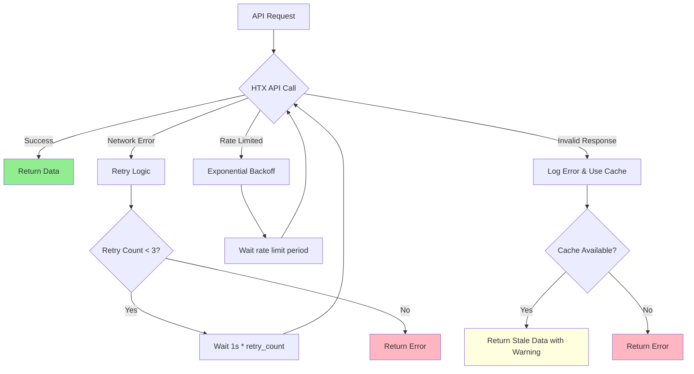

## WebSocket Connection Lifecycle

This diagram shows the complete lifecycle of a WebSocket connection.

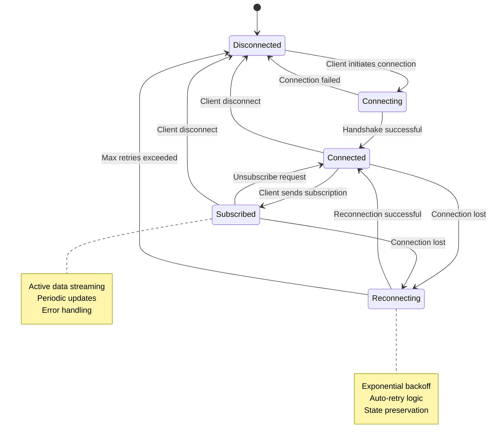

## Data Caching Strategy

This diagram illustrates the multi-level caching strategy used in the system.

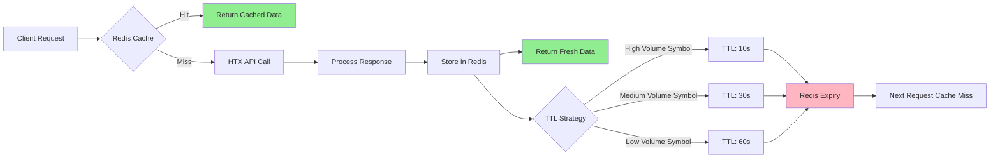

## Frontend Component Data Flow

This diagram shows how data flows through the React frontend components.

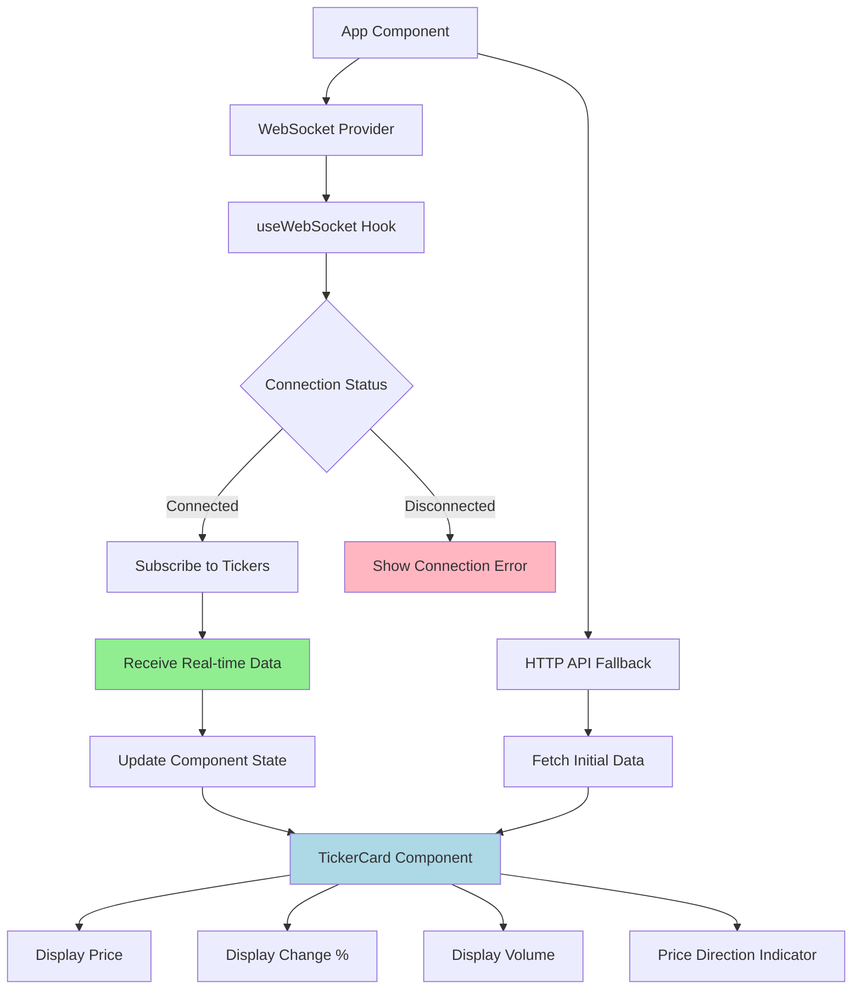

## Integration with External Systems

This diagram shows how the system integrates with external services and infrastructure.

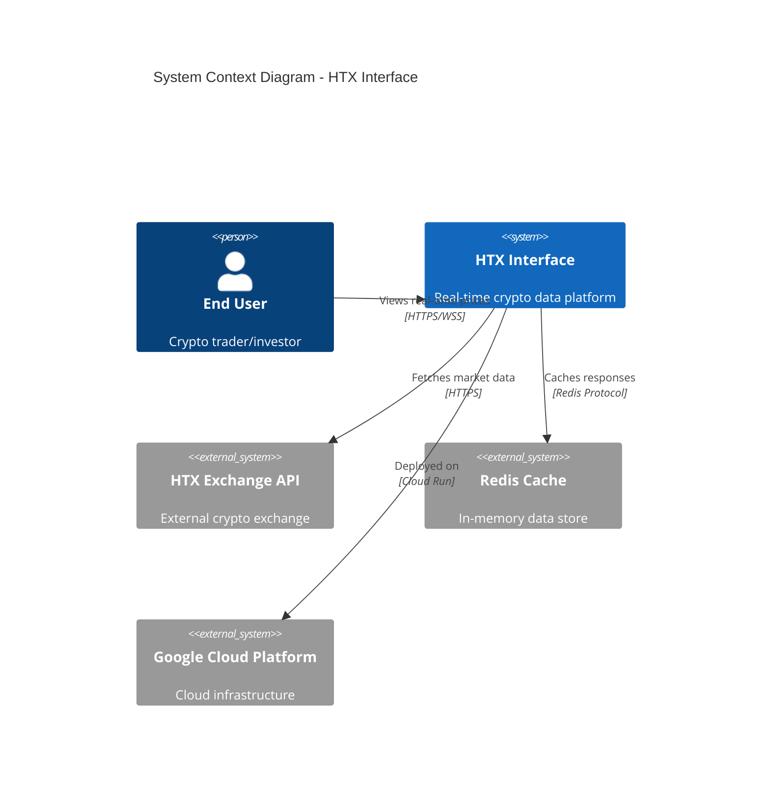

## GCS Upload Flow with Signed URLs

This diagram shows the secure file upload process using Google Cloud Storage signed URLs.

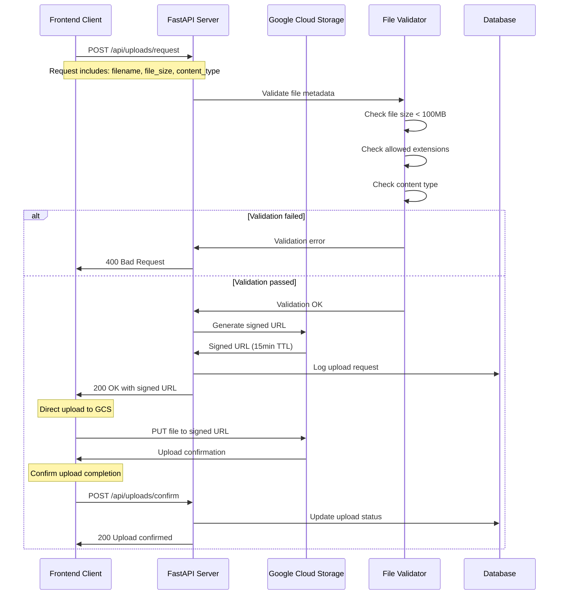

## Enhanced WebSocket Flow with Reconnection

This diagram shows the enhanced WebSocket flow with exponential backoff and UX improvements.

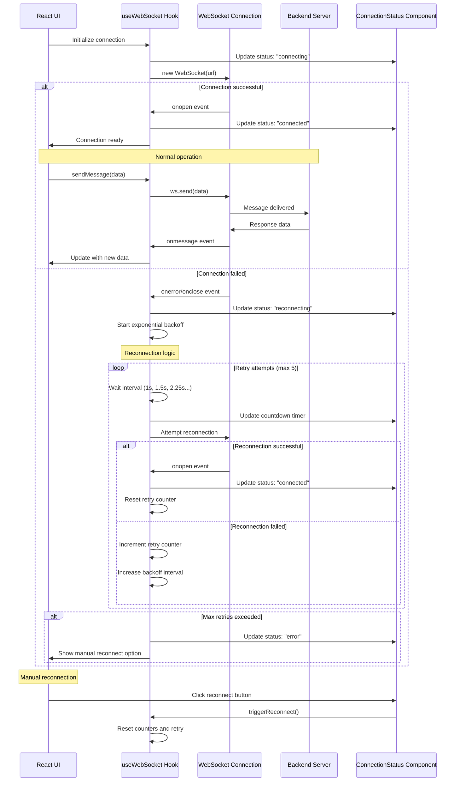

## Advanced Error Handling and Recovery Flow

This comprehensive diagram shows error handling across different system layers.

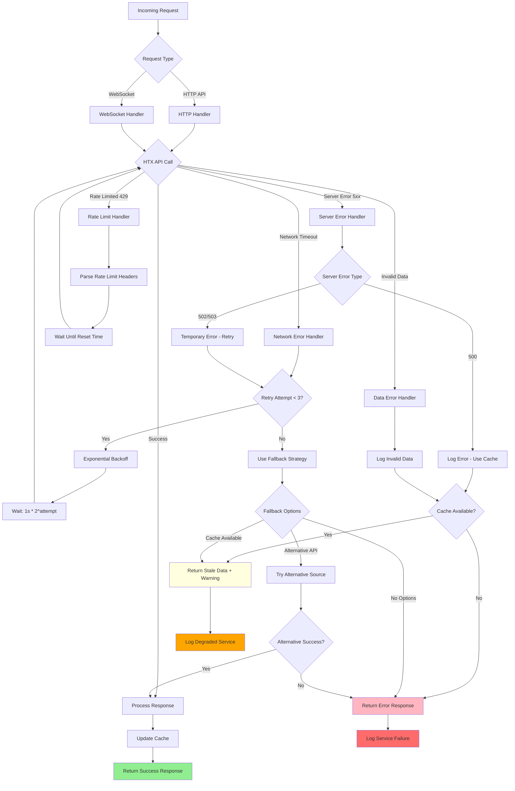

## WebSocket Connection State Machine

This detailed state machine shows all possible WebSocket connection states and transitions.

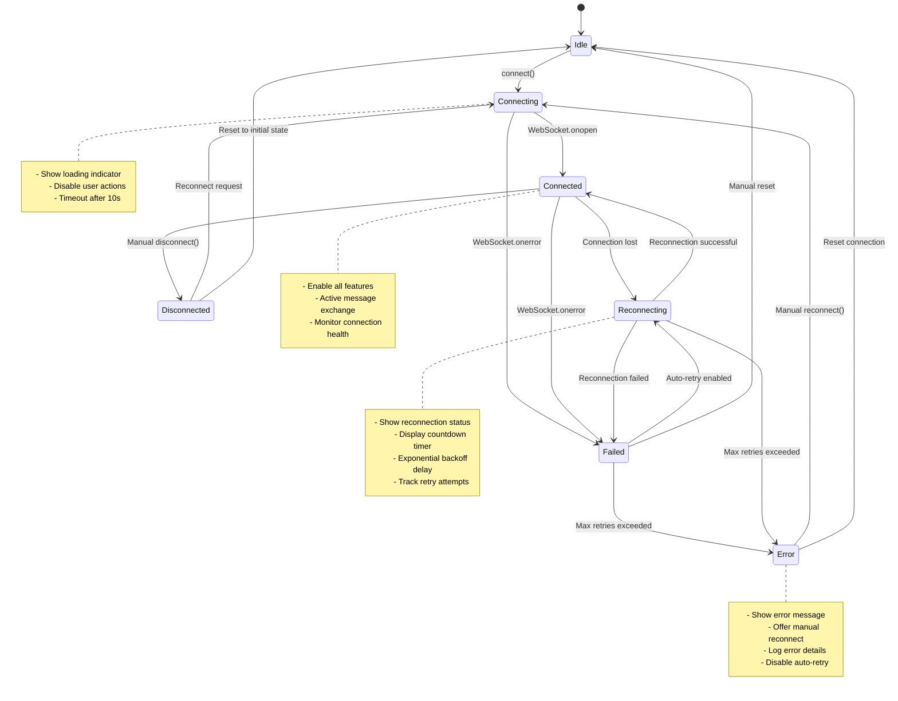

## System Integration and Data Flow Architecture

This high-level diagram shows the complete system architecture and data flow.

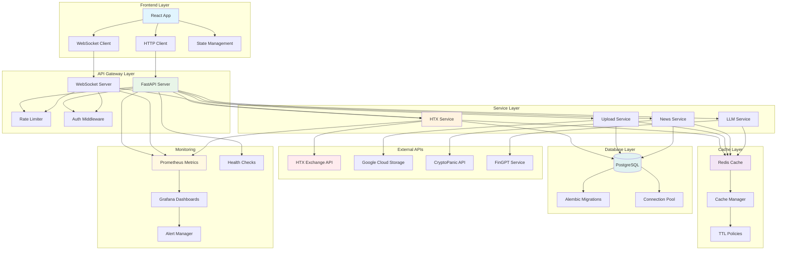

---

## Notes

- All diagrams use standard Mermaid syntax and should render properly in GitHub
- WebSocket connections implement automatic reconnection with exponential backoff (1s → 30s max)
- HTTP API includes comprehensive rate limiting and retry mechanisms
- GCS uploads use signed URLs for secure, direct-to-cloud file transfers
- Caching strategy with intelligent TTL policies reduces external API load
- Error handling ensures graceful degradation with multiple fallback strategies
- Enhanced UX provides clear connection status and manual recovery options
- Monitoring infrastructure provides comprehensive observability across all layers
- State machines ensure predictable connection behavior and user experience
