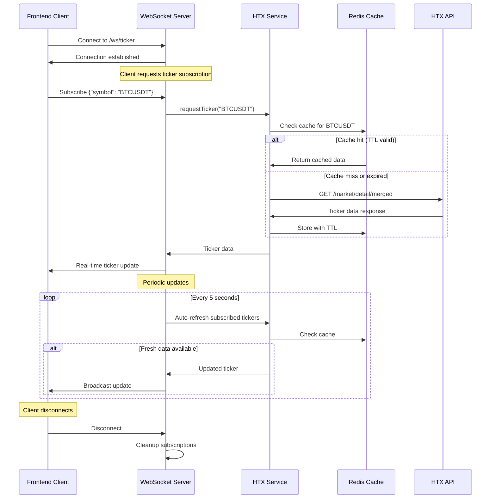
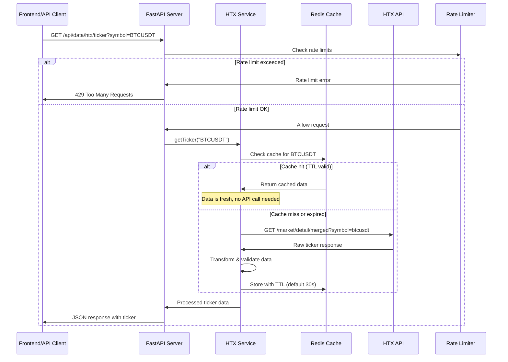
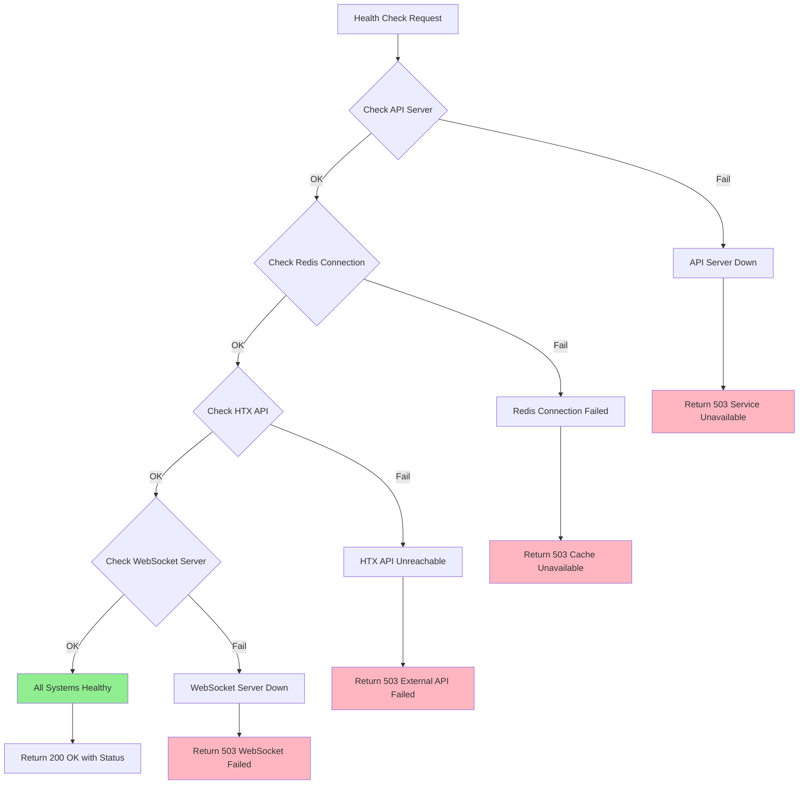
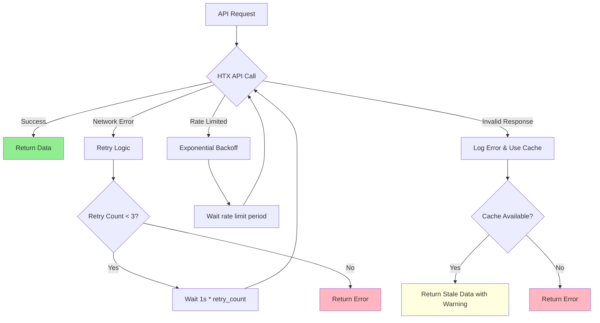
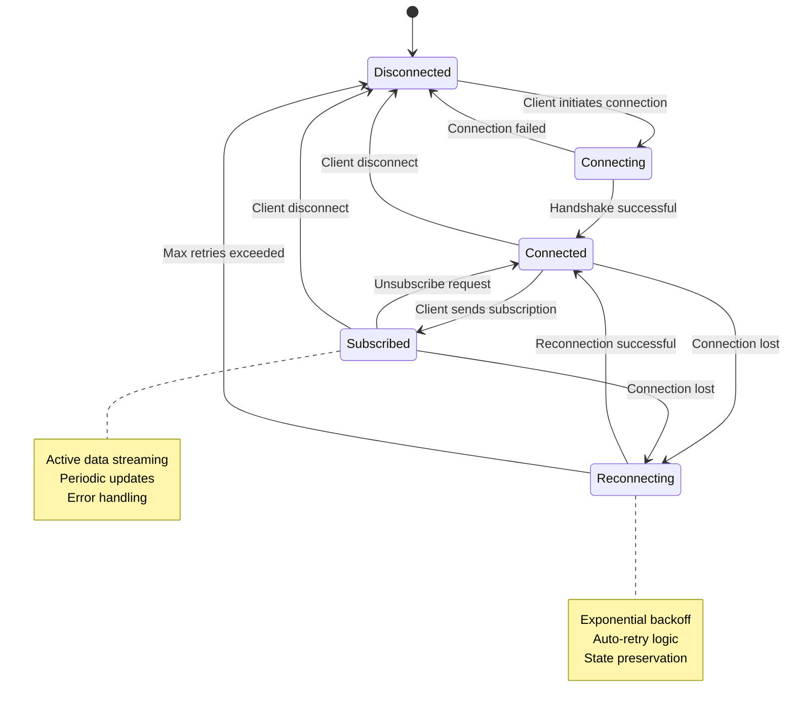
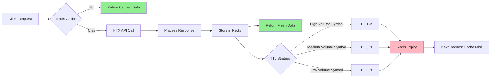
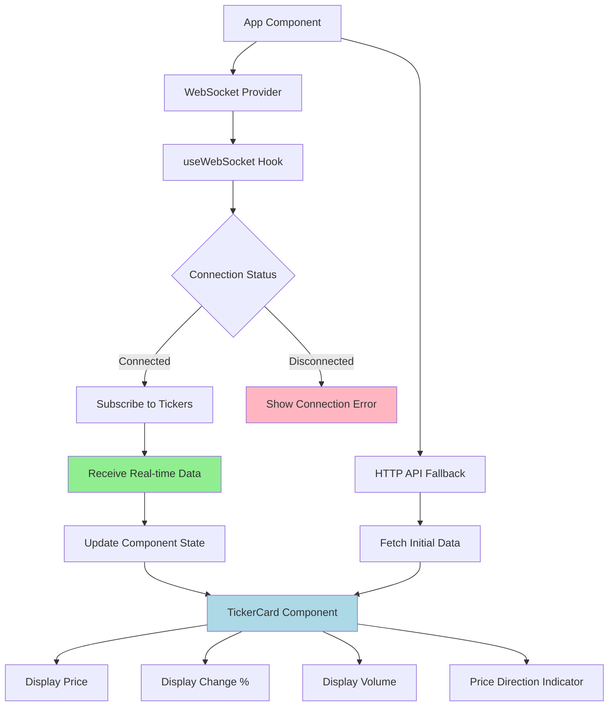
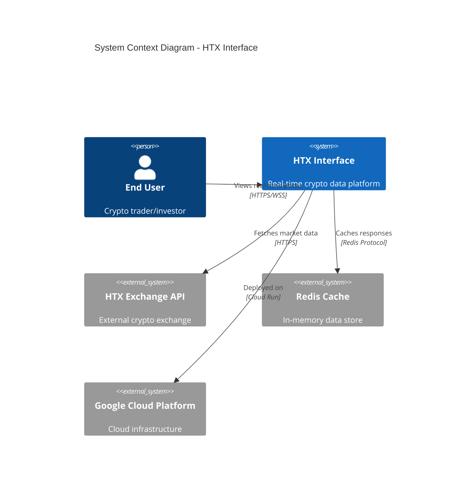

# Data Flow Diagrams

This document describes the data flows and interactions between different components of the HTX Interface system using Mermaid diagrams.

## WebSocket Ticker Flow

This diagram shows the real-time data flow for cryptocurrency ticker updates via WebSocket connection.

## HTTP API Ticker Flow

This diagram shows the traditional HTTP request-response flow for ticker data.

## Health Check Flow

This diagram shows the health monitoring and system status checking flow.

## Error Handling and Retry Logic

This diagram shows how the system handles errors and implements retry mechanisms.

## WebSocket Connection Lifecycle

This diagram shows the complete lifecycle of a WebSocket connection.

## Data Caching Strategy

This diagram illustrates the multi-level caching strategy used in the system.

## Frontend Component Data Flow

This diagram shows how data flows through the React frontend components.

## Integration with External Systems

This diagram shows how the system integrates with external services and infrastructure.

---

## Notes

- All diagrams use standard Mermaid syntax and should render properly in GitHub
- WebSocket connections implement automatic reconnection with exponential backoff
- HTTP API includes rate limiting to prevent abuse
- Caching strategy reduces external API calls and improves response times
- Error handling ensures graceful degradation when external services are unavailable
- Health checks provide visibility into system status and dependencies
