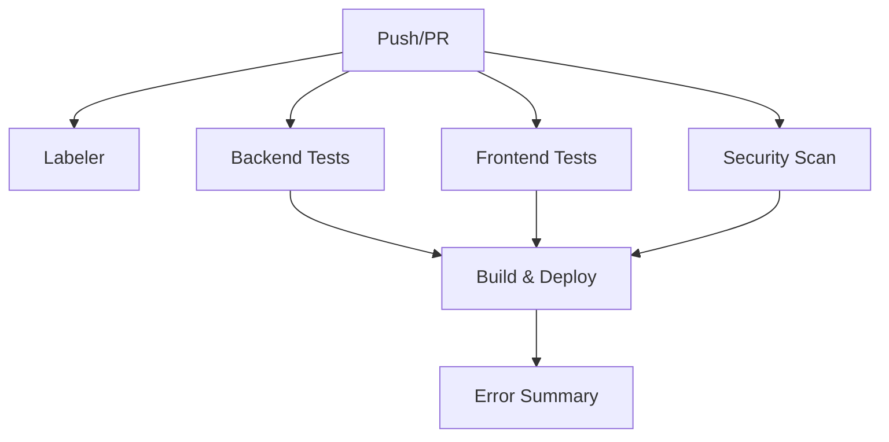

# GitHub Actions CI/CD Документация

Документация по настройке и использованию GitHub Actions для HTX Interface проекта.

## Обзор CI/CD Pipeline

Наш CI/CD pipeline состоит из нескольких независимых jobs, которые выполняются параллельно для обеспечения быстрой обратной связи:



## Структура Workflow

### Основные Jobs

1. **Labeler** - Автоматическое присвоение меток PR
2. **Backend** - Тестирование backend с pytest
3. **Frontend** - Тестирование frontend с Vitest
4. **Security** - Сканирование на уязвимости
5. **Build and Deploy** - Сборка Docker образов и деплой
6. **Error Summary** - Сводка ошибок и артефактов

### Triggers (Триггеры)

```yaml
on:
  push:
    branches: [ main ]
  pull_request:
    branches: [ main ]
  workflow_dispatch:  # Ручной запуск
```

## Настройка Окружения

### Требуемые Secrets

Для работы CI/CD необходимо настроить следующие secrets в GitHub:

| Secret | Описание | Где получить |
|--------|----------|--------------|
| `GCP_SA_KEY` | Ключ сервисного аккаунта GCP | `terraform output -raw github_actions_sa_key` |

### Настройка Secrets

1. Перейдите в Settings → Secrets and variables → Actions
2. Нажмите "New repository secret"
3. Добавьте `GCP_SA_KEY`:

```bash
# Получить ключ из Terraform
cd infra/terraform
terraform output -raw github_actions_sa_key
```

## Детальное описание Jobs

### 1. Labeler Job

Автоматически присваивает метки PR на основе измененных файлов.

**Конфигурация:** `.github/labeler.yml`

```yaml
labeler:
  name: Auto-label PR
  permissions:
    contents: read
    pull-requests: write
  runs-on: ubuntu-latest
  if: github.event_name == 'pull_request'
```

**Поддерживаемые метки:**
- `backend` - изменения в backend/
- `frontend` - изменения в frontend/
- `docs` - изменения в docs/
- `ci` - изменения в .github/
- `terraform` - изменения в infra/

### 2. Backend Job

Тестирование Python backend с pytest.

**Возможности:**
- Установка Python 3.11
- Установка зависимостей с pip
- Запуск pytest с coverage
- Линтинг с ruff
- Сохранение логов как артефакты

**Артефакты:**
- `backend-errors/pytest.log` - логи тестов
- `backend-errors/lint.log` - логи линтера

```bash
# Локальный запуск аналога
cd backend
pip install -r requirements.txt
pytest --verbose --tb=short
ruff check . --output-format=text
```

### 3. Frontend Job

Тестирование Next.js frontend с Vitest.

**Возможности:**
- Установка Node.js 20
- Установка зависимостей с npm
- Запуск Vitest тестов
- TypeScript проверка
- ESLint линтинг
- Сохранение логов как артефакты

**Артефакты:**
- `frontend-errors/vitest.log` - логи тестов
- `frontend-errors/typecheck.log` - логи TypeScript
- `frontend-errors/lint.log` - логи ESLint

```bash
# Локальный запуск аналога
cd frontend
npm install
npm run test
npm run type-check
npm run lint
```

### 4. Security Job

Сканирование кода на уязвимости и секреты.

**Инструменты:**
- TruffleHog - поиск секретов в коде
- GitHub Security Features

**Конфигурация:**
- Сканирование только verified секретов
- Continue on error для не критичных находок

```yaml
- name: Run TruffleHog filesystem scan
  uses: trufflesecurity/trufflehog@main
  with:
    base: ""
    head: ${{ github.sha }}
    extra_args: --only-verified
  continue-on-error: true
```

### 5. Build and Deploy Job

Основной job для сборки и деплоя приложения.

**Стадии:**

1. **Аутентификация в GCP**
2. **Сборка Docker образов**
3. **Push в Artifact Registry**
4. **Деплой в Cloud Run**
5. **Health проверки**
6. **Генерация отчета о деплое**

**Деплой стратегия:**
- Backend → Frontend → FinGPT (последовательно)
- Health проверки между деплоями
- Автоматическое обновление environment переменных

### 6. Error Summary Job

Собирает все ошибки и создает сводный отчет.

**Артефакты:**
- `error-summary/error-summary.md` - сводка всех ошибок
- Включает логи из всех предыдущих jobs

## Артефакты и Логи

### Структура Артефактов

```
artifacts/
├── backend-errors/
│   ├── pytest.log         # Логи тестов pytest
│   └── lint.log           # Логи ruff линтера
├── frontend-errors/
│   ├── vitest.log         # Логи Vitest тестов
│   ├── typecheck.log      # Логи TypeScript проверки
│   └── lint.log           # Логи ESLint
├── deployment-report/
│   └── deployment-report.md  # Отчет о деплое с URL сервисов
└── error-summary/
    └── error-summary.md   # Сводка всех ошибок
```

### Скачивание Артефактов

**Через GitHub UI:**
1. Перейдите в Actions → выберите workflow run
2. Прокрутите вниз до секции "Artifacts"
3. Скачайте нужные артефакты

**Через GitHub CLI:**
```bash
# Установка GitHub CLI
# https://cli.github.com/

# Скачать артефакты последнего run
gh run list --limit 1
gh run download [RUN_ID]

# Скачать конкретный артефакт
gh run download [RUN_ID] -n backend-errors
```

## Мониторинг и Отладка

### Типичные Проблемы и Решения

#### 1. Тесты Backend Падают

**Симптомы:**
- Backend job завершается с ошибкой
- pytest.log содержит ошибки

**Отладка:**
```bash
# Локальная проверка
cd backend
python -m pytest --verbose --tb=long

# Проверка зависимостей
pip install -r requirements.txt
pip check
```

#### 2. Frontend Тесты Не Проходят

**Симптомы:**
- Frontend job завершается с ошибкой
- vitest.log содержит ошибки

**Отладка:**
```bash
cd frontend
npm install
npm run test -- --reporter=verbose
npm run type-check
```

#### 3. Деплой в GCP Не Удается

**Симптомы:**
- Build and Deploy job падает на стадии gcloud deploy

**Проверки:**
1. Проверить GCP_SA_KEY secret
2. Проверить permissions сервисного аккаунта
3. Проверить квоты Cloud Run

```bash
# Проверка сервисного аккаунта
gcloud iam service-accounts list
gcloud projects get-iam-policy PROJECT_ID

# Проверка Cloud Run сервисов
gcloud run services list --region=us-central1
```

#### 4. Docker Образы Не Собираются

**Симптомы:**
- Ошибки на стадии docker build

**Отладка:**
```bash
# Локальная сборка
docker build -t test-backend backend/
docker build -t test-frontend frontend/
docker build -t test-fingpt fingpt/

# Проверка Dockerfile
docker build --no-cache -t test-image .
```

### Логирование и Мониторинг

#### GitHub Actions Logs

Каждый step создает детальные логи:

```yaml
- name: Run tests with detailed logging
  run: |
    echo "::group::Installing dependencies"
    pip install -r requirements.txt
    echo "::endgroup::"
    
    echo "::group::Running tests"
    pytest --verbose 2>&1 | tee pytest.log
    echo "::endgroup::"
```

#### GCP Cloud Logging

После деплоя можно мониторить через Cloud Logging:

```bash
# Логи Cloud Run сервисов
gcloud logs read "resource.type=cloud_run_revision AND resource.labels.service_name=htx-interface-backend" --limit=50

# Логи с фильтрацией по уровню
gcloud logs read "severity>=ERROR" --limit=20
```

## Оптимизация Performance

### Ускорение CI/CD

1. **Параллельные Jobs**
   - Backend и Frontend тесты выполняются параллельно
   - Security сканирование не блокирует основные тесты

2. **Кэширование**
```yaml
- name: Cache pip dependencies
  uses: actions/cache@v4
  with:
    path: ~/.cache/pip
    key: ${{ runner.os }}-pip-${{ hashFiles('**/requirements.txt') }}

- name: Cache npm dependencies
  uses: actions/cache@v4
  with:
    path: ~/.npm
    key: ${{ runner.os }}-npm-${{ hashFiles('**/package-lock.json') }}
```

3. **Conditional Execution**
```yaml
- name: Run backend tests
  if: contains(github.event.head_commit.modified, 'backend/')
```

### Мониторинг Времени Выполнения

Типичные времена выполнения:

| Job | Среднее время | Оптимальное время |
|-----|---------------|-------------------|
| Labeler | 10-15 сек | < 30 сек |
| Backend | 2-3 мин | < 5 мин |
| Frontend | 1-2 мин | < 3 мин |
| Security | 1-2 мин | < 3 мин |
| Build & Deploy | 5-10 мин | < 15 мин |

## Расширение и Кастомизация

### Добавление Новых Checks

1. **Создать новый job:**
```yaml
  new-check:
    name: New Check
    runs-on: ubuntu-latest
    needs: [backend, frontend]  # зависимости
    steps:
      - uses: actions/checkout@v4
      - name: Run new check
        run: echo "New check implementation"
```

2. **Добавить в dependencies:**
```yaml
  build-and-deploy:
    needs: [backend, frontend, security, new-check]
```

### Интеграция с внешними сервисами

**Уведомления в Slack:**
```yaml
- name: Notify Slack
  if: failure()
  uses: 8398a7/action-slack@v3
  with:
    status: failure
    webhook_url: ${{ secrets.SLACK_WEBHOOK }}
```

**Интеграция с Jira:**
```yaml
- name: Create Jira issue on failure
  if: failure()
  uses: atlassian/gajira-create@v3
  with:
    project: PROJECT
    issuetype: Bug
```

## Безопасность

### Защита Secrets

1. **Никогда не логируйте secrets**
```yaml
- name: Deploy to GCP
  run: |
    echo "Deploying..." # ✅ OK
    echo "${{ secrets.GCP_SA_KEY }}" # ❌ NEVER DO THIS
  env:
    GCP_SA_KEY: ${{ secrets.GCP_SA_KEY }}
```

2. **Используйте environment protection**
```yaml
environment:
  name: production
  url: ${{ steps.deploy.outputs.url }}
```

### OIDC Authentication (Рекомендуется)

Для повышения безопасности рекомендуется использовать OIDC вместо service account keys:

```yaml
- name: Authenticate to Google Cloud
  uses: google-github-actions/auth@v2
  with:
    workload_identity_provider: 'projects/PROJECT_NUMBER/locations/global/workloadIdentityPools/POOL_ID/providers/PROVIDER_ID'
    service_account: 'github-actions@PROJECT_ID.iam.gserviceaccount.com'
```

## Troubleshooting Guide

### Чек-лист диагностики

1. **Проверить статус GitHub Actions**
   - https://www.githubstatus.com/

2. **Проверить syntax workflow файла**
```bash
# Локальная проверка с act
npm install -g @github/workflow-parser
workflow-parser .github/workflows/ci-cd.yml
```

3. **Проверить permissions**
   - Repository settings → Actions → General
   - Workflow permissions должны быть "Read and write"

4. **Проверить GCP квоты**
```bash
gcloud compute project-info describe
```

### Полезные команды

```bash
# Просмотр последних runs
gh run list --limit 10

# Просмотр логов конкретного run
gh run view [RUN_ID] --log

# Отмена running jobs
gh run cancel [RUN_ID]

# Повторный запуск failed jobs
gh run rerun [RUN_ID] --failed
```

## Лучшие практики

### 1. Именование и структура

- Используйте понятные имена для jobs и steps
- Группируйте логи с `::group::` / `::endgroup::`
- Добавляйте описания к outputs

### 2. Обработка ошибок

```yaml
- name: Step with error handling
  run: |
    set -e
    command_that_might_fail || {
      echo "::error::Command failed"
      exit 1
    }
  continue-on-error: false
```

### 3. Тестирование изменений

- Используйте feature branches для тестирования workflow изменений
- Тестируйте на fork репозитории перед merge в main
- Используйте `workflow_dispatch` для ручного тестирования

### 4. Мониторинг и алерты

- Настройте уведомления о failed builds
- Мониторьте время выполнения workflows
- Регулярно просматривайте и архивируйте артефакты

---

## Полезные ссылки

- [GitHub Actions Documentation](https://docs.github.com/en/actions)
- [Google Cloud GitHub Actions](https://github.com/google-github-actions)
- [Docker Build and Push Action](https://github.com/docker/build-push-action)
- [Artifact Actions](https://github.com/actions/upload-artifact)
