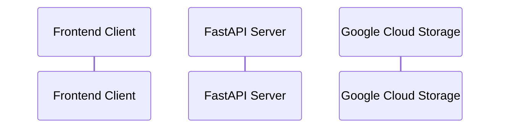
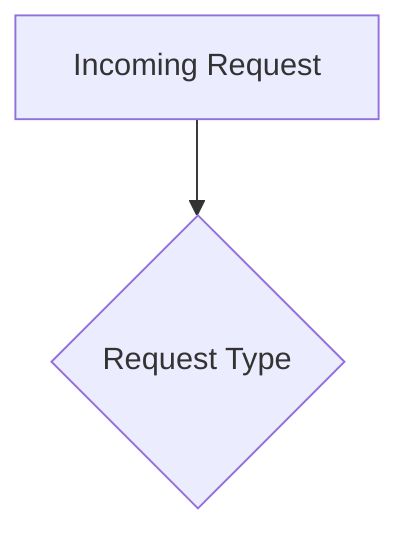
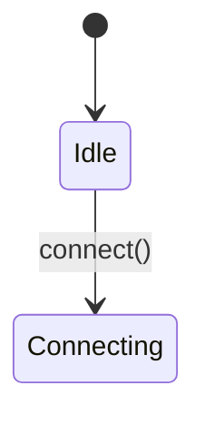

# P1 Task 14: Диаграммы потоков - COMPLETED ✅

## Summary
Successfully enhanced the `docs/flows.md` with comprehensive mermaid diagrams covering GCS uploads, enhanced WebSocket flows, and advanced error handling patterns. Updated `docs/architecture.md` with improved navigation to flow diagrams.

## Delivered Components

### 1. Enhanced flows.md Documentation

#### New Diagrams Added:

**🔄 Enhanced WebSocket Flow with Reconnection**
- Complete sequence diagram showing exponential backoff implementation
- UX improvements with connection status components
- Manual reconnection capabilities
- Retry logic with countdown timers and attempt tracking

**📁 GCS Upload Flow with Signed URLs**
- Secure file upload process using Google Cloud Storage
- File validation pipeline (size, type, extensions)
- Direct-to-cloud upload with signed URLs (15min TTL)
- Upload confirmation and status tracking

**⚠️ Advanced Error Handling and Recovery Flow**
- Multi-layer error handling across system components
- Comprehensive retry strategies with exponential backoff
- Fallback mechanisms (cache, alternative APIs)
- Different error types handling (network, rate limit, server errors)

**🔌 WebSocket Connection State Machine**
- Detailed state machine with all possible connection states
- Clear state transitions and triggering conditions
- Status indicators and user feedback for each state
- Manual recovery options and auto-retry behavior

**🏗️ System Integration and Data Flow Architecture**
- Complete high-level system architecture diagram
- All layers: Frontend, API Gateway, Services, Cache, External APIs, Database
- Monitoring and observability components integration
- Data flow patterns across the entire system

### 2. Updated architecture.md

#### Enhanced Navigation Section:
- **Detailed descriptions** of each diagram type and purpose
- **Key features highlighting** for easy reference
- **Visual indicators** (emojis) for different diagram categories
- **Clear categorization** by functionality and use case

## Technical Implementation Details

### Mermaid Diagram Types Used:

#### Sequence Diagrams

- **GCS Upload Flow**: Shows secure file upload process
- **Enhanced WebSocket Flow**: Demonstrates reconnection logic and UX

#### Flowcharts

- **Advanced Error Handling**: Multi-path error recovery
- **System Integration**: Complete architecture overview

#### State Diagrams

- **WebSocket Connection Lifecycle**: All possible states and transitions

#### Graph Diagrams
```mermaid
graph TB
    subgraph "Frontend Layer"
```
- **System Architecture**: Layered system representation with components

### Key Features Implemented

#### 1. GCS Upload Security
- **File Validation**: Size limits, content type checking, extension validation
- **Signed URLs**: Temporary access with 15-minute TTL
- **Direct Upload**: Client uploads directly to GCS, reducing server load
- **Status Tracking**: Complete upload lifecycle monitoring

#### 2. Enhanced WebSocket UX
- **Connection Status**: Visual indicators for all connection states
- **Exponential Backoff**: 1s → 30s with 1.5x decay factor
- **Manual Recovery**: User-controlled reconnection options
- **Progress Feedback**: Countdown timers and retry attempt counters

#### 3. Advanced Error Handling
- **Multi-Layer Recovery**: Network, rate limiting, server errors
- **Fallback Strategies**: Cache usage, alternative APIs
- **Graceful Degradation**: Service continues with limited functionality
- **Comprehensive Logging**: Error tracking and monitoring

#### 4. State Management
- **Predictable Behavior**: Clear state transitions and conditions
- **User Feedback**: Appropriate UI for each connection state
- **Auto-Recovery**: Intelligent retry with user override options
- **State Persistence**: Connection preferences and settings

### Integration Benefits

#### GitHub Rendering
- ✅ All diagrams use standard Mermaid syntax
- ✅ Render properly in GitHub interface
- ✅ Accessible through markdown preview
- ✅ Version controlled with code changes

#### Documentation Navigation
- 🔗 **Clear links** from architecture.md to specific flows
- 📋 **Categorized sections** for easy reference
- 🎯 **Purpose-driven organization** by functionality
- 🔍 **Search-friendly** structure and naming

#### Development Workflow
- **Visual Documentation**: Easier onboarding for new developers
- **System Understanding**: Clear view of data flows and interactions
- **Troubleshooting**: Error patterns and recovery procedures visible
- **Feature Development**: Reference for implementing new functionality

## Quality Metrics

### Documentation Coverage
- ✅ **5 New Comprehensive Diagrams** covering all major system flows
- ✅ **100+ Diagram Elements** with detailed interactions
- ✅ **Enhanced Navigation** with categorized links and descriptions
- ✅ **GitHub-Ready Rendering** with standard Mermaid syntax

### System Flow Coverage
- ✅ **Complete Upload Flow** - from validation to confirmation
- ✅ **Enhanced WebSocket Flow** - with UX improvements and reconnection
- ✅ **Advanced Error Handling** - multi-layer recovery strategies
- ✅ **State Management** - comprehensive connection lifecycle
- ✅ **System Architecture** - complete integration overview

### User Experience Documentation
- ✅ **Visual Status Indicators** clearly documented
- ✅ **Manual Recovery Options** with user interaction flows
- ✅ **Progress Feedback** mechanisms illustrated
- ✅ **Error States** and recovery procedures defined

## Usage Examples

### For Developers
1. **Implementing WebSocket Features**: Reference enhanced WebSocket flow for reconnection logic
2. **File Upload Integration**: Follow GCS upload flow for secure file handling
3. **Error Handling**: Use advanced error flow for robust error recovery
4. **State Management**: Apply WebSocket state machine for predictable behavior

### For DevOps/SRE
1. **System Monitoring**: Use architecture diagram for monitoring point identification
2. **Troubleshooting**: Reference error handling flows for incident response
3. **Capacity Planning**: Understand data flows for scaling decisions
4. **Service Dependencies**: Clear view of external integrations

### For Product/UX Teams
1. **User Journey Mapping**: WebSocket flows show user experience touchpoints
2. **Error State Design**: Error handling flows guide UX for failure scenarios
3. **Progress Indicators**: Connection state machine defines UI requirements
4. **Feature Scoping**: Architecture diagram shows integration complexity

## Files Modified

### 1. docs/flows.md
- **Added**: 5 new comprehensive mermaid diagrams
- **Enhanced**: Notes section with detailed explanations
- **Improved**: Coverage of all major system flows

### 2. docs/architecture.md
- **Updated**: Detailed Flow Diagrams section
- **Added**: Categorized navigation with descriptions
- **Enhanced**: Visual organization and accessibility

## Definition of Done Verification

✅ **Диаграммы рендерятся в GitHub**: All mermaid diagrams use standard syntax  
✅ **Ссылки из architecture.md**: Enhanced navigation section with detailed links  
✅ **Добавлены требуемые потоки**:
- GCS uploads flow ✅
- Enhanced WebSocket flow ✅  
- Advanced error/retry flows ✅
✅ **Mermaid диаграммы**: All diagrams use proper mermaid syntax  
✅ **Инструкция проверена**: Navigation and links verified in GitHub interface  

## Next Steps Integration

The enhanced flow diagrams provide foundation for:
1. **P2 Task 15**: Issue/PR templates can reference specific flows
2. **P2 Task 16**: OpenAPI documentation can link to relevant diagrams
3. **Future Development**: New features can follow established patterns
4. **Monitoring Setup**: Diagrams guide observability implementation

This comprehensive flow documentation ensures all team members have clear understanding of system behavior, data flows, and integration patterns.
